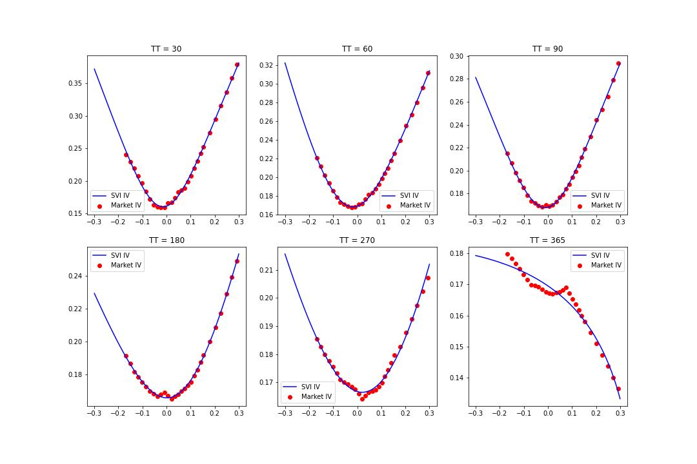
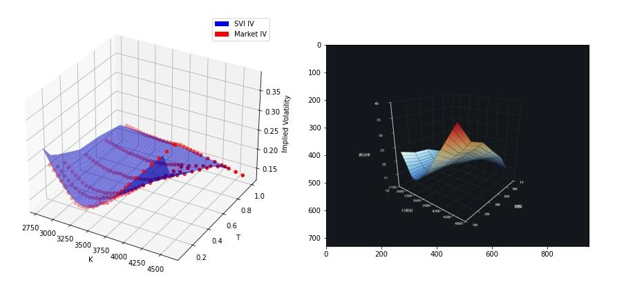
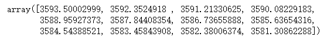
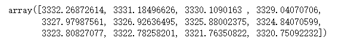
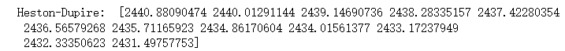

# 
European Option Pricing Based on Heston-Dupire

### 
Group 8: Gong Jiaxin, Zou Xuyuan

# 1. Theory
## 1.1 Heston-Dupire Model
The Heston-Dupire immediate local volatility model is a model that combines the local volatility obtained from the Dupire formula in its unparameterized form with the Heston stochastic volatility model.

$$
d S_t=r S_t d t+L\left(t, S_t\right) \sqrt{V_t} S_t d W_{1 t}
$$

$$
d V_t=a\left(b-V_t\right) d_t+\sigma_v \sqrt{V_t} d W_{2 t}
$$

## 1.2 Leverage function

### 1.2.1 Derivation of leverage function
 Let the price of the European call option be　
$$
C(t, K)=\frac{B_{t_0}}{B_t} E\left[\left(S_t-K\right)^{+}\right]
$$
 Differentiating the the above equation, and using Fubini's theorem, we get, 

$$
d C(t, K)=-\frac{r}{M_t} E\left[\left(S_t-K\right)^{+}\right] d t+\frac{1}{M_t} E\left[d\left(S_t-K\right)^{+}\right]
$$
 This function is not differentiable at x =  c  and cannot be solved directly by Itoˆ 's lemma. However, this problem can be solved by the following Tanaka-Meyer formula. 
$$
g\left(X_t\right)=g\left(X_{t_0}\right)+\int_{t_0}^t 1_{X_u>b} d \tilde{B}_u+\int_{t_0}^t 1_{X_u>b} d V_u+\frac{1}{2} \int_{t_0}^t g^{\prime \prime}\left(X_u\right)\left(d \tilde{B}_u\right)^2
$$
 To further simplify the calculation, the well-known conclusion from Feng (2010) can be used.  If St, Vt  obey the stochastic local volatility model in 1.1, then the following equation holds for the price of a European call option.
$$
-\frac{\partial C(t, K)}{\partial K}=\frac{1}{B_t} E\left[1_{S_t>K}\right], \frac{\partial C^2(t, K)}{\partial K^2}=\frac{\psi_S}{B_t}
$$
 Then we get the leverage function
$$
L^2(t, K)=\frac{\frac{\partial C(t, K)}{\partial t}+r K \frac{\partial C(t, K)}{\partial K}}{\frac{1}{2} K^2 \frac{\partial^2 C(t, K)}{\partial K^2} E\left[V_t \mid S_t=K\right]}=\frac{\sigma_{L V}^2(t, K)}{E\left[V_t \mid S_t=K\right]}
$$

### 1.2.2 Calculation of leverage function
### Numerator

$$
\begin{aligned}
E\left[V_{t_{i}} \mid S_{t_{i}}=s_{i, j}\right] & \approx \frac{E\left[V_{t_{i}} \mathbb{1}_{S_{t_{i}} \in\left(b_{i, k}, b_{i, k+1}\right]}\right]}{\mathbb{Q}\left[S_{t_{i}} \in\left(b_{i, k}, b_{i, k+1}\right]\right]} \\
& \approx \frac{\frac{1}{M} \sum_{j=1}^{M} v_{i, j} \mathbb{1}_{s_{i, j} \in\left(b_{i, k}, b_{i, k+1}\right]}}{\mathbb{Q}\left[S_{t_{i}} \in\left(b_{i, k}, b_{i, k+1}\right]\right]} \\
& \approx \frac{l}{M} \sum_{j \in \mathscr{f}_{i, k}} v_{i, j}
\end{aligned}
$$

### Denominator

$$
\sigma_{L V}^2(T, K)=\frac{\sigma_I^2+2 T \sigma_I\left(\frac{\partial \sigma_I}{\partial T}+r K \frac{\partial \sigma_I}{\partial K}\right)}{\left(1+d_1 K \sqrt{T} \frac{\partial \sigma_l}{\partial K}\right)^2+K^2 \sigma_I T\left(\frac{\partial^2 \sigma_I}{\partial K^2}-d_1 \sqrt{T}\left(\frac{\partial \sigma_l}{\partial K}\right)^2\right)}
$$

 To get σI  We first use the SVI (Stochastic Volatility Inspired) function to fit in the K-direction , followed by linear interpolation in the T-direction. And then we obtain the implied volatility surface by combining the two directions.

$$
\sigma_{I}^{S V I}=\sqrt{\frac{\alpha_{n}+\beta_{n}\left[\rho_{n}\left(x-m_{n}\right)+\sqrt{\left(x-m_{n}\right)^{2}+\sigma_{n}}\right]}{T_{n}}}
$$

$$
\min J_n(\boldsymbol{C})=\frac{1}{2} \sum_{i=1}^M w_i\left(\frac{\sigma_I^{S V I}\left(T_n, K_i ; \boldsymbol{C}\right)-\sigma_I^{\text {Market }}\left(T_n, K_i\right)}{\sigma_I^{\text {Market }}\left(T_n, K_i\right)}\right)^2
$$

$$
\sigma_I^{S V I}(T, x)=\frac{T_{n+1}-T}{T_{n+1}-T_n} \sigma_I^{S V I}\left(T_n, x\right)+\frac{T-T_n}{T_{n+1}-T_n} \sigma_I^{S V I}\left(T_{n+1}, x\right)
$$

 To complete the calculation of the rest of leverage function, we take the numerical derivatives by difference.

$$
\begin{aligned}
\sigma_{I} & =\sigma_{I}^{S V I}(T, x)=\lambda_{n} \sigma_{I}^{S V I}\left(T_{n}, x\right)+\lambda_{n+1} \sigma_{I}^{S V I}\left(T_{n+1}, x\right) \\
\frac{\partial \sigma_{I}}{\partial T} & =\frac{1}{T_{n+1}-T_{n}}\left[\sigma_{I}^{S V I}\left(T_{n+1}, x\right)-\sigma_{I}^{S V I}\left(T_{n}, x\right)\right] \\
\frac{\partial \sigma_{I}}{\partial x} & =\tau_{n} f_{n}^{(1)}+\tau_{n+1} f_{n+1}^{(1)} \\
\frac{\partial^{2} \sigma_{I}}{\partial x^{2}} & =\tau_{n} f_{n}^{(2)}+\tau_{n+1} f_{n+1}^{(2)}
\end{aligned}
$$

# 2. Practice
## 2.1 Fitting volatility based on SVI
 We select the CSI 300 put option data on December 29, 2023, and fit the implied volatility surface using the SVI method.

## 2.2 Model result
*  strike = np.arange(2900, 3500, 50) 
* sigma, vov, mr, rho, texp, spot = 0.3, 1, 0.5, -0.9, 20, 3431.1099 
### 2.2.1 Heston model

*  Lewis AL (2000) Option valuation under stochastic volatility: with Mathematica code. Finance Press

*  Conditional MC for Heston model based on QE discretization scheme by Andersen (2008)

### 2.2.2 Heston-Dupire
*  Var calculation is based on QE method, and we use Euler method to obtain ST 

$$
d X_{t}=\left(r-\frac{1}{2} L^{2}\left(t, e^{X_{t}}\right) V_{t}\right) d t+L\left(t, e^{X_{t}}\right), \sqrt{V_{t}} d W_{1 t}
$$

